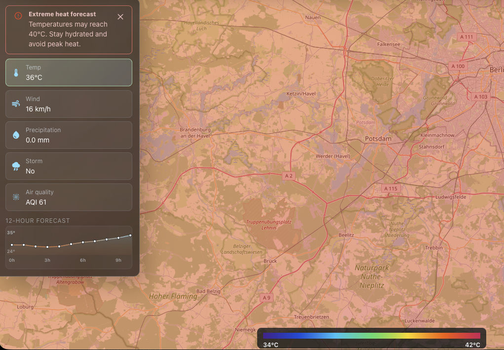

# Aether

[Live demo on Vercel](https://aether-five-rose.vercel.app)

Aether is an interactive full-screen weather map built with React, TypeScript, Material-UI, Leaflet, and Canvas. It displays live weather fields over OpenStreetMap and updates the visible area as the map moves.



## Features

- Animated wind particles colored by speed
- Interpolated temperature layer and legend
- European AQI layer with PM2.5 readings
- Animated precipitation radar
- Storm and lightning effects
- Weather values at the mouse position
- City search and animated map navigation
- Persistent browser cache using IndexedDB
- Automatic background refresh while the app is open
- Responsive, compact map controls
- Vercel deployment configuration

## Data sources

- [Open-Meteo](https://open-meteo.com/) supplies modeled temperature, wind, precipitation, cloud, and storm data.
- [Copernicus Atmosphere Monitoring Service (CAMS)](https://atmosphere.copernicus.eu/) supplies modeled air-quality data through the Open-Meteo Air Quality API.
- [RainViewer](https://www.rainviewer.com/api.html) supplies precipitation radar tiles.
- [OpenStreetMap](https://www.openstreetmap.org/) supplies the base map.
- [MeteoGate](https://meteogate.eu/) supplies official European high-temperature warnings from MeteoAlarm members.

Open-Meteo data is licensed under [CC BY 4.0](https://open-meteo.com/en/license). Air-quality data requires attribution to both CAMS and Open-Meteo. RainViewer requires attribution and its free API is intended for personal, educational, and small-scale community use. OpenStreetMap tiles must follow the [tile usage policy](https://operations.osmfoundation.org/policies/tiles/).

For a commercial or high-traffic deployment, review every provider's current terms and use production-grade map and radar providers where needed.

## Requirements

- Node.js 20.19 or newer
- npm

## Local development

```bash
npm install
npm run dev
```

Open the local URL printed by Vite.

## Production build

```bash
npm run build
```

The production output is written to `dist`.

To inspect the production build locally:

```bash
npm run preview
```

## Deploy to Vercel

Import the repository into Vercel. The included `vercel.json` configures:

- Vite as the framework
- `npm run build` as the build command
- `dist` as the output directory
- Long-lived caching for hashed assets
- A cached serverless proxy for Open-Meteo requests

Set `METEOGATE_KEY` in Vercel to enable official European heat warnings:

```text
METEOGATE_KEY=your-meteogate-api-key
```

## Main structure

```text
src/
  components/   React interface and map components
  map/          Weather animation and radar layers
  services/     Weather, geocoding, and browser cache services
  weather/      Weather response translation
  types/        Shared TypeScript data types
```

## Accuracy

Wind and temperature are modeled grid values with interpolation between fetched points. They are not measurements for every map pixel. Radar availability and resolution depend on RainViewer coverage.

## License

The Aether source code is available under the [MIT License](LICENSE). Third-party maps, weather data, radar tiles, icons, and libraries keep their own licenses and terms.
